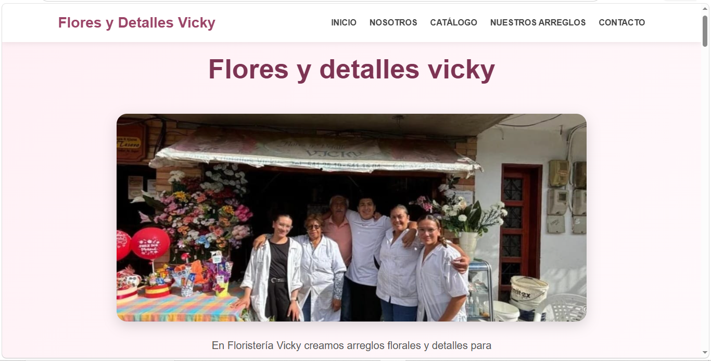
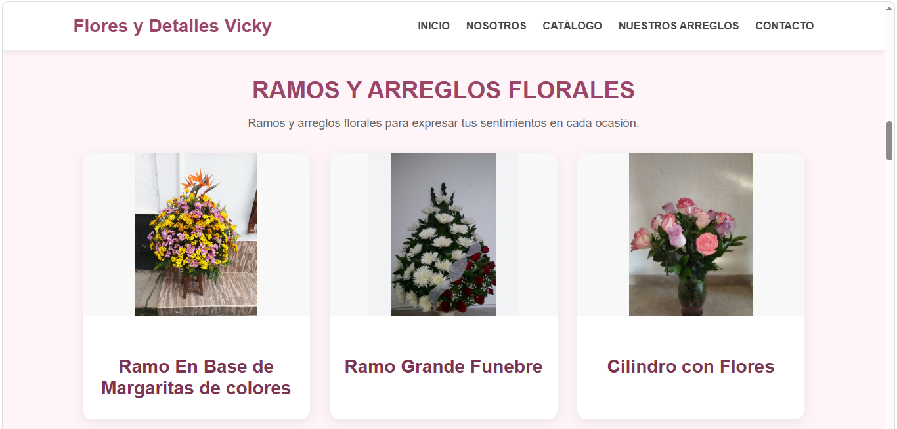
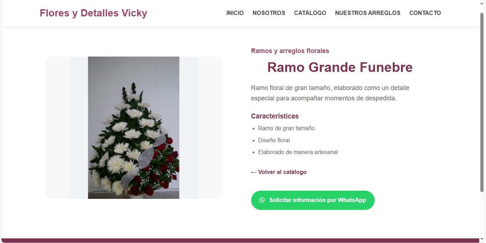
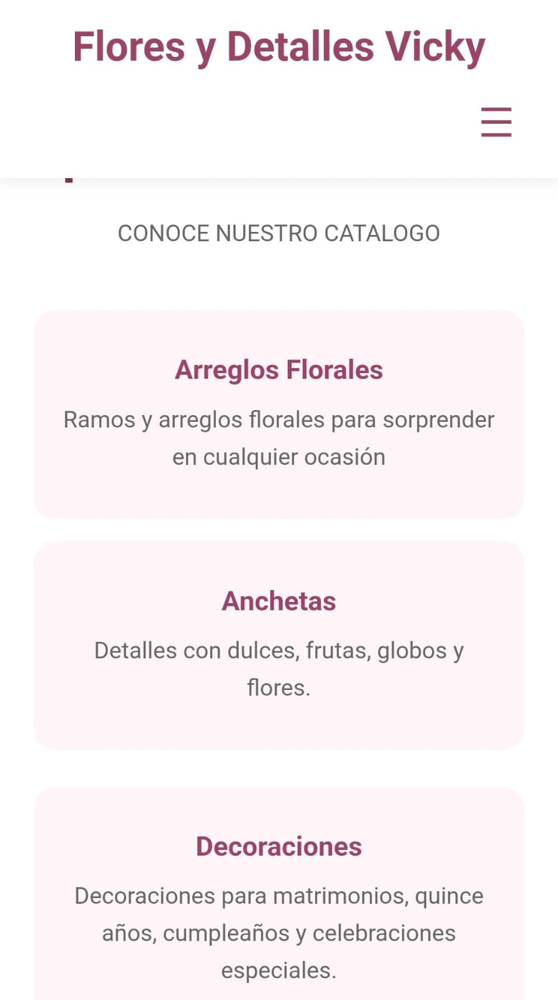
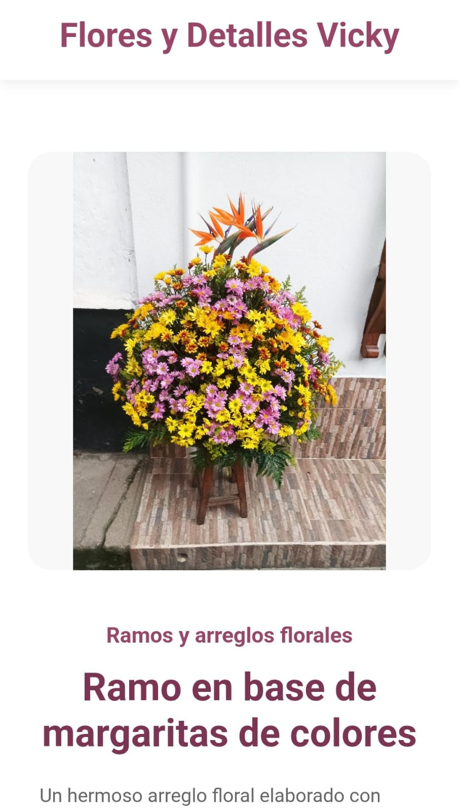

# Flores y Detalles Vicky
## Descripción del proyecto

Flores y Detalles Vicky es una página web creada para presentar el trabajo y los productos de la floristería vicky. En ella se pueden conocer los diferentes arreglos, anchetas, decoraciones y opciones de catering que ofrece el negocio.
La página también permite consultar información de cada producto, comunicarse por WhatsApp y enviar un mensaje a través del formulario de contacto.

## Página web

Puedes visitar la página de Flores y Detalles Vicky en el siguiente enlace:https://floristeria-web-cyan.vercel.app/

## Tecnologías utilizadas

Para crear esta página se utilizaron:
- HTML para organizar el contenido de la página.
- CSS para darle el diseño, los colores y adaptarla a diferentes tamaños de pantalla.
- JavaScript para agregar funciones y hacer que la página sea más interactiva.
- Vercel para publicar la página en internet.

## Funcionalidades

La página cuenta con diferentes funciones para facilitar la navegación y conocer los productos:

- Menú de navegación para acceder a las diferentes secciones.
- Menú desplegable para facilitar la navegación desde el celular.
- Catálogo organizado por categorías.
- Información detallada de cada producto.
- Botón para solicitar información directamente por WhatsApp.
- Formulario de contacto para enviar un mensaje.
- Validación de los datos del formulario antes de enviarlo.

## Diseño para diferentes dispositivos

La página fue diseñada para verse correctamente tanto en computadores como en celulares.
En el celular se puede utilizar un menú desplegable para facilitar la navegación y los productos se organizan para que sean fáciles de visualizar.
También se cuidó la distribución de las imágenes, los textos y los botones para que la página sea cómoda de utilizar en diferentes tamaños de pantalla.

## Organización del contenido
El catálogo está organizado por diferentes categorías para que los visitantes puedan encontrar fácilmente el tipo de producto que están buscando.
Los productos se presentan de forma ordenada y cada uno puede abrirse para consultar información más detallada. También se buscó mantener una distribución sencilla y agradable para que las imágenes y la información se puedan visualizar fácilmente.

## JavaScript y formulario

Se agregaron diferentes funciones para hacer la página más interactiva.
El catálogo permite seleccionar un producto para ver su información con más detalle. También se agregó el menú desplegable para celulares.
El formulario de contacto revisa que los campos estén completos, que el correo tenga un formato válido y que el mensaje tenga una cantidad mínima de caracteres. Si hay algún error, se muestra un mensaje junto al campo correspondiente.

## Uso de inteligencia artificial
Durante el desarrollo del proyecto se utilizó inteligencia artificial como apoyo para resolver dudas, organizar algunas ideas y revisar partes del código.
Las sugerencias recibidas fueron revisadas y adaptadas al proyecto, realizando los cambios necesarios para que funcionaran de acuerdo con las necesidades de la página.

## Dificultad principal

Una de las principales dificultades fue lograr que cada producto del catálogo mostrara su información correspondiente en una misma página de detalle.
Para solucionarlo, se organizó la información de los productos y se hizo que la página identificara cuál producto había seleccionado el visitante. De esta manera, se puede reutilizar la misma página para mostrar diferentes productos sin tener que crear una página diferente para cada uno.

## Capturas de pantalla

### Vista en computador

### Vista en celular

